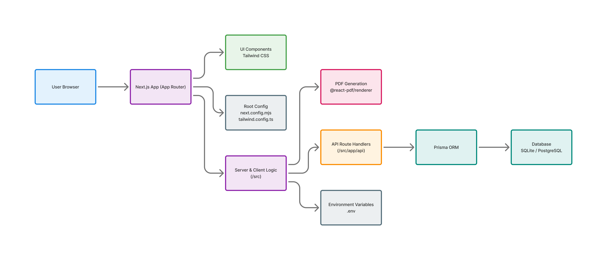

# 🧾 Invoico

## Modern Invoicing, Made Simple

**Invoico** is a sleek, modern, and efficient web application for creating professional invoices. Built with simplicity and performance in mind, it is designed for freelancers, small businesses, and service providers who want a clean billing workflow — from invoice creation to client delivery via PDF or email.

---

## 🚀 Key Features

- 📄 **Professional PDF invoices** — Company branding, line items, payment instructions, and terms & conditions
- 💰 **South African Rand (ZAR)** — Full currency support with proper formatting (e.g. R 1 234,56)
- Email drafts - Open a prepared mail draft so each business can send invoices from its own email account
- 🌙 **Dark mode** — Toggle with system preference detection and localStorage persistence
- 📦 **Services with per-line discount** — Add line items; optionally discount per service (e.g. free demo: set amount, then discount same)
- 📋 **Collapsible services** — Expand/collapse service cards; arrow rotates; new services auto-expand
- 🔢 **Auto-generated invoice numbers** — Format: `INV-YYYYMMDD-CLIENT` (e.g. INV-20250208-JD for John Doe)
- 🎨 **Polished UI** — Header with GitHub credit, theme toggle, animated splash screen

---

## 🏗️ Architecture Overview



---

## 🧱 Tech Stack

| Area | Technology |
|------|------------|
| Framework | Next.js 14 (App Router) |
| Language | TypeScript |
| UI & Styling | Tailwind CSS, DaisyUI |
| Animations | Framer Motion |
| PDF Generation | jsPDF |
| Email | `mailto:` draft |
| Icons | Lucide React |

**Project Structure**

```text
src/
├── app/              # Next.js App Router
│   ├── api/          # API routes
│   ├── layout.tsx
│   ├── page.tsx
│   └── globals.css
├── components/       # React components
│   ├── Header.tsx     # App header with GitHub credit & theme toggle
│   ├── InvoiceForm.tsx
│   ├── ServiceItem.tsx
│   ├── SplashScreen.tsx
│   ├── Footer.tsx
│   ├── ThemeToggle.tsx
│   └── ui/           # Reusable UI components
└── utils/
    └── generateDoc.ts # PDF generation (jsPDF)
```

---

## ⚙️ Installation & Setup

### 📌 Clone the Repository

```bash
git clone https://github.com/aj4200/invoico.git
cd invoico
```

### 📦 Install Dependencies

```bash
npm install
```

### 🔐 Environment Configuration

No email provider setup is required. Invoico opens a prepared `mailto:` draft in the business user's own email app.
### ▶️ Run the App Locally

```bash
npm run dev
```

Open your browser at:

```text
http://localhost:3000
```

---

## 🧾 Application Usage

1. **Client information** — Enter client name, email, address, and phone.
2. **Invoice details** — Invoice number is auto-generated from client name and date (editable). Set invoice and due dates.
3. **Services** — Add line items with description, date, quantity, unit price, and optional per-line discount (e.g. free demo).
4. **Tax** — Add tax (VAT) if applicable.
5. **Download or email** - Export as PDF, then open a prepared email draft for the client.

---

## 📄 PDF Export

Invoico generates professional PDF invoices with:

- Company branding and invoice badge
- Bill-to and from sections
- Line items table (Description, Date, Qty, Unit Price, Discount, Amount)
- Subtotal, tax, and amount due
- Payment instructions (EFT, PayShap)
- Terms & conditions
- Footer with registration and VAT details

---

## 📧 Email Invoices

1. Ensure the client email is filled in.
2. Click **Download PDF** if you want to attach the invoice.
3. Click **Open Email Draft**.
4. Your email app opens with the client, subject, amount due, due date, PayShap, and bank details filled in.
5. Attach the downloaded PDF and send from your own email account.
---

## 🔐 Environment Variables

No email environment variables are required.
---

## 📡 API Endpoints

No email API endpoint is required for draft-based sending.
---

## 🤝 Contributing

Contributions are welcome and appreciated.

1. Fork the repository
2. Create a new feature branch
3. Commit your changes with clear messages
4. Open a pull request for review

---

## 🚨 Issues & Support

If you encounter bugs or have feature requests, please use the GitHub **Issues** tab and provide as much detail as possible.

---

## 📜 License

This project is licensed under the **MIT License**, allowing you to use, modify, and distribute the software freely.

---

## 🙌 Acknowledgements

Built with passion and precision by [@aj4200](https://github.com/aj4200) 💙
